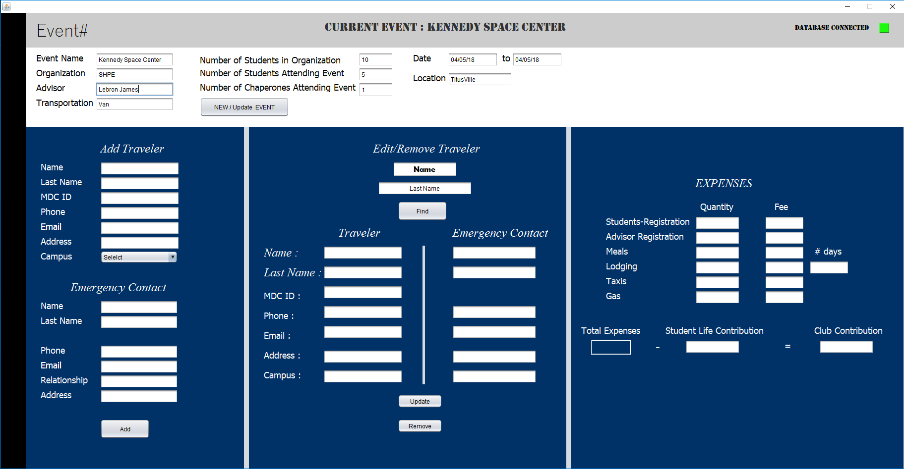

# Event

      

**\#Event** is a Windows desktop application build on **Java**, designed to create your live easier when it comes to organize your needs for an event.

**\#Event** is designed and coded with ❤️ by [MDC Blue](https://mdc.blue) Programming Team members.

## Installing

#### Prerequisites

* Windows 7 or higher.
* Access 2012 \(Office Product\) or higher installed
* [UCanAccess](http://ucanaccess.sourceforge.net/site.html) library
* [JavaFX Material Design](http://www.jfoenix.com/) library

### Window

Download the latest [**\#Event**](./) release.

## Contributing

Please note that this project is licensed under MIT License. By participating in this project you agree to abide by its terms.

See [Contributing Guide]()

## Contributors

|  |  | image | image |
| --- | --- | --- | --- |
| [Abraham](https://github.com/19cah) | [Emanuel](https://github.com/Jikiyama) | [Luis F.](https://github.com/LuisRobaina) | [Adriel](https://github.com/Adriel1221) |

## License

[MDC Blue](https://github.com/MDCblue) © 2018 [MIT License](https://github.com/MDCblue/event/tree/78e5fa6e290fc5fd2fc706f311fbe96769a589e8/LICENSE/README.md)

