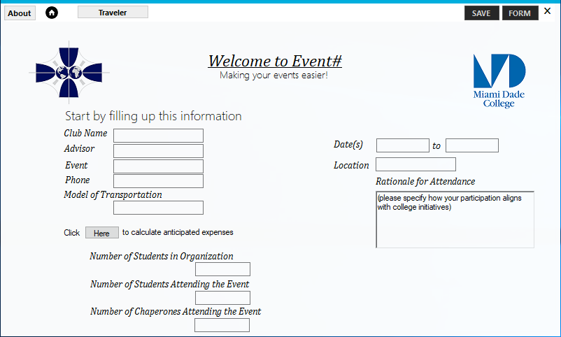

# 🅴🆅🅴🅽🆃 

>*Making your events easier*

**#Event** is a Windows desktop application build on **C#**, designed to create your live easier when it comes to organize your needs for an event. 

<!---->

**#Event** is designed and coded with ❤️ by [MDC Blue](https://mdc.blue) Programming Team members.

# Installing

#### Prerequisites

- Window 7 or higher.

## Window

Download the latest [**#Event**](#) release.

# Contributing 

Please note that this project is licensed under MIT License. By participating in this project you agree to abide by its terms.

See [Contributing Guide](.github/CONTRIBUTING.md)

# Contributors

 |  | image | 
--- | --- | --- | 
[Abraham](https://github.com/19cah) | [Emanuel](https://github.com/Jikiyama) | [Luis F.](https://github.com/LuisRobaina) | 

# License

[MDC Blue](https://github.com/MDCblue) © 2018 [MIT License](LICENSE)

<!-- https://www.youtube.com/watch?v=60fdNF57X8U -->
