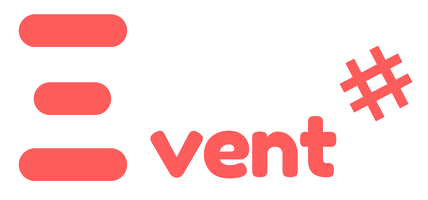

# Event

      

**\#Event** is a Windows desktop application build on **Java**, designed to create your live easier when it comes to organize your needs for an event.

## Reference

* **Event** App website: [eventgenerator.ga](https://eventgenerator.ga)
* Documentation: [docs.eventgenerator.ga](https://docs.eventgenerator.ga)

**\#Event** is designed and coded with ❤️ by [MDC Blue](https://mdc.blue) Programming Team members.

### Installing

**Prerequisites**

* Windows 7 or higher.
* JDK 8.
* Microsoft Access Database.
* [UCanAccess](http://ucanaccess.sourceforge.net/site.html) library.
* [JavaFX Material Design](http://www.jfoenix.com/) library.

#### Window

Download the latest [**\#Event**](./) release.

### Contributing

Please note that this project is licensed under MIT License. By participating in this project you agree to abide by its terms.

See [Contributing Guide](./)

### Contributors

|  |  |  |
| --- | --- | --- |
| [Abraham](https://github.com/19cah) | [Luis F.](https://github.com/LuisRobaina) | [Emanuel](https://github.com/Jikiyama) |

### License

[MDC Blue](https://github.com/MDCblue) © 2018 [MIT License](https://github.com/MDCblue/event/tree/78e5fa6e290fc5fd2fc706f311fbe96769a589e8/LICENSE/README.md)

