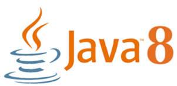
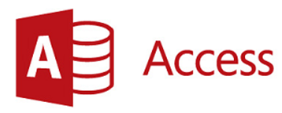

# GETTING STARTED

## Requirements:

**Event\#** is a Window desktop application, therefore is the only possible platform available  to use Event.

Event is build on Java, so its require to have installed the [Java JDK 8.](https://en.wikipedia.org/wiki/Java_version_history#Java_SE_8) Please [download JDK 8](http://www.oracle.com/technetwork/java/javase/downloads/jdk8-downloads-2133151.html) and install it on your machine.

Event requires [Microsoft Access](https://en.wikipedia.org/wiki/Microsoft_Access) database. You can [buy or try free Access](https://products.office.com/en-US/access).

Event requires a third party library to set a connection using Java and Office, we are using [UCanAccess](http://ucanaccess.sourceforge.net/site.html). You need to [download it](https://sourceforge.net/projects/ucanaccess/files/) and include it on your project library.

Events its build with JavaFX, so [JFoeniX](http://www.jfoenix.com/) its a JavaFX Material Design Library to make User Interface comfortable. Download [JFoenix for JDK 8](https://github.com/jfoenixadmin/JFoenix) and include it on your project source.

