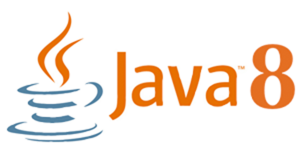
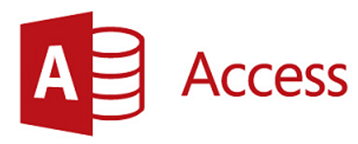

# GETTING STARTED

## Requirements:

**Event\#** is a Window desktop application, therefore is the only possible platform available  to use Event.

Event is build on Java, so its require to have installed the [Java JDK 8.](https://en.wikipedia.org/wiki/Java_version_history#Java_SE_8) Please [download JDK 8](http://www.oracle.com/technetwork/java/javase/downloads/jdk8-downloads-2133151.html) and install it on your machine.

Event requires [Microsoft Access](https://en.wikipedia.org/wiki/Microsoft_Access) database. You can [buy or try free Access](https://products.office.com/en-US/access).

#### STEPS {#steps}

1. [Download Cleaver for macOS](https://getcleaver.com/?ref=docs).
2. To avoid any issue with the file permissions and to avoid any kind of possible data loss, copy Cleaver app to your _/Applications_ folder first.
3. Open the app and sign in. If you have not signed up yet, it only takes few seconds to create a new account.

