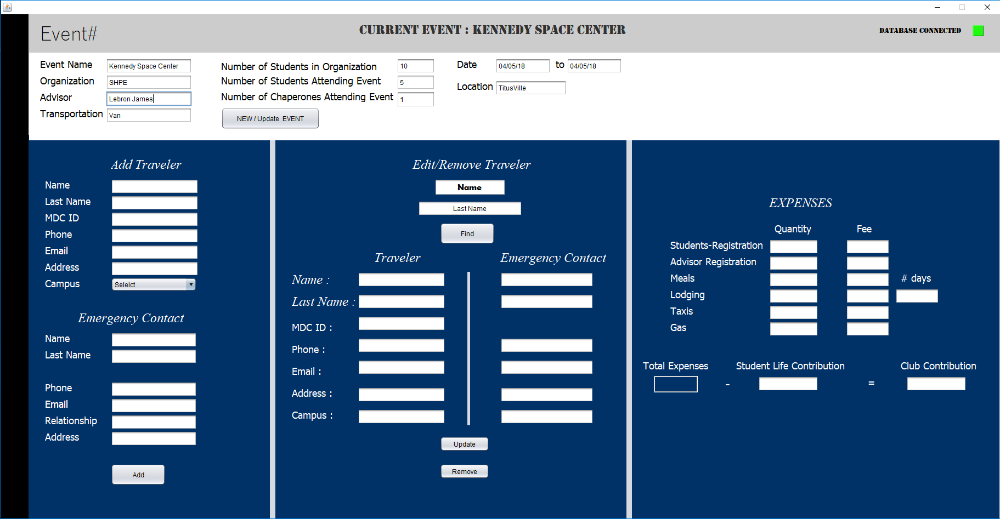

  

**Event** is a cross-platform desktop application build on **Java**, designed to create your live easier when it comes to organize your needs for an event.

**Event** is designed for [Miami Dade College](http://mdc.edu), but it can fit needs for other schools or colleges.

**Event** is created with ❤️ by [MDC Blue](https://github.com/hialeah) Programming Team members.

## Installing

#### Prerequisites

- Windows 7 or later.
- macOS Sierra of later
- [UCanAccess](http://ucanaccess.sourceforge.net/site.html) library
- [JavaFX Material Design](http://www.jfoenix.com/) library

### Download

Download the latest [**\#Event**](https://eventgenerator.ga/#download-section) release.

## Contributing

Please note that this project is licensed under MIT License. By participating in this project you agree to abide by its terms.

See [Contributing Guide](https://github.com/hialeah/event/blob/master/.github/contribution-guidelines.md)

## License

[MDC Blue](https://github.com/hialeah) © 2018 [MIT License](https://github.com/hialeah/event/blob/master/license)
